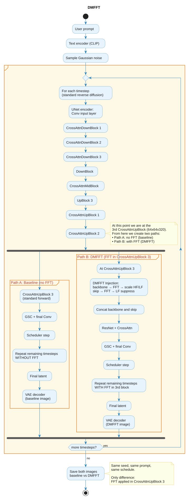
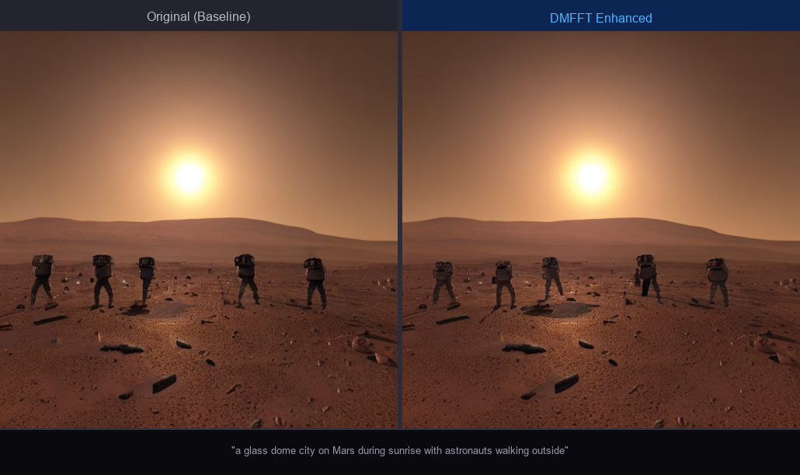
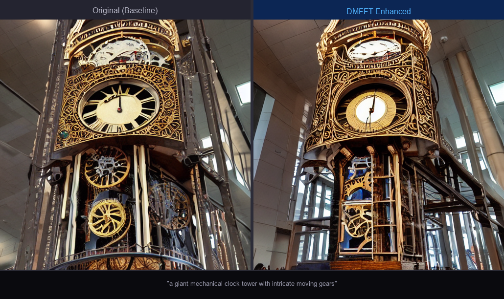

# DMFFT: Improving the Generation Quality of Diffusion Models Using Fast Fourier transform


## **Team Members:** 
1. Kiruthika K (CB.SC.U4AIE24329) - [cb.sc.u4aie24329@cb.students.amrita.edu](mailto:cb.sc.u4aie24329@cb.students.amrita.edu)
2. Mithul Pranav (CB.SC.U4AIE24331) -  [cb.sc.u4aie24331@cb.students.amrita.edu](mailto:cb.sc.u4aie24331@cb.students.amrita.edu)
3. Maalika P (CB.SC.U4AIE24332)-  [cb.sc.u4aie24332@cb.students.amrita.edu](mailto:cb.sc.u4aie24332@cb.students.amrita.edu)
4. Rithan S (CB.SC.U4AIE24348) -  [cb.sc.u4aie24348@cb.students.amrita.edu](mailto:cb.sc.u4aie24348@cb.students.amrita.edu)


## Objective
The primary objective of this research is to propose DMFFT (Diffusion Models using Fast Fourier Transform), to enhance generation quality.
Specifically, the method aims to:
- Integrate Frequency Domain Analysis into the Sampling Process: Decompose U-Net feature extraction results from both the backbone and lateral skip connections into their frequency, amplitude, and phase components
- Provide Precise Visual Control: Establish suggested scaling intervals for high-frequency features to optimise semantics and brightness, and low-frequency features to improve clarity and texture
- Improve Efficiency: Utilise the Fast Fourier Transform (FFT) to maintain a low time complexity (O(N log N)), ensuring that quality improvements add negligible inference time without increasing memory consumption


## Problem Statement
AI image generation has exploded in popularity, but even the diffusion models like Stable Diffusion produce images that are often slightly blurry, lack fine details, and don't perfectly match what you asked for.

**The Traditional Approach (Expensive)**
To improve image quality, researchers typically:
- Train larger models 
- Use more computational resources (expensive GPUs)
- Fine-tune for specific tasks (time-consuming)
- Add complex architectural modifications

This project bridges classical signal processing with modern generative AI.


## Reference Paper

**Title:** DMFFT: improving the generation quality of diffusion models using fast Fourier transform

**Authors:** Cuihong Yu, Cheng Han, Chao Zhang

**Published:** Scientific Reports (2025) 15:10200

**DOI:** [10.1038/s41598-025-94381-8](https://doi.org/10.1038/s41598-025-94381-8)

### Key Contribution
The paper introduces a novel method to enhance diffusion model generation quality by:
- Transforming U-Net features to frequency domain using Fast Fourier Transform
- Selectively manipulating high/low frequency, amplitude, and phase components
- Achieving quality improvements without training or additional parameters
- Improving semantic alignment, color/texture, and temporal consistency


## Project Outline

### Overview
DMFFT (Diffusion Models with Fast Fourier Transform) is a training-free image enhancement method that significantly improves the quality of images generated by diffusion models such as Stable Diffusion. By leveraging classical Fourier transform techniques in the frequency domain, DMFFT achieves superior semantic alignment, structural clarity, color texture, and overall visual quality without requiring model retraining, fine-tuning, or additional parameters.

This project provides a complete implementation in Python that integrates FFT directly inside the reverse diffusion process of Stable Diffusion (not post-processing), reproducing and validating the results from the research paper.

### Mathematical Techniques 
The Fast Fourier Transform (FFT) is a highly optimized algorithm that computes the Discrete Fourier Transform (DFT) of a sequence, breaking down complex signals into their frequency components. It reduces computational complexity from O(N²) to O(N log N), enabling real-time signal analysis. Common efficient applications include audio processing, imaging, and telecommunications.

What this does is convert an image from pixels (what you see) to frequencies (waves that make up the image).

### Simple Demonstration: Toy Example

#### Sharpen a Blurry Number "1"

To understand DMFFT at its core, here's a minimal example using a tiny 5×5 image.

##### **Input: Blurry Digit**
```matlab
% Create blurry number "1" (5×5 pixels)
img_blurry = [
    0   50   0   0   0;
    0   50   0   0   0;
    0   50   0   0   0;
    0   50   0   0   0;
    0  100   0   0   0
];
```

##### **Apply DMFFT Enhancement**
```matlab
% 1. FFT: Convert to frequency domain
F = fftshift(fft2(img_blurry));

% 2. Create frequency mask
mask = ones(5,5) * 2.0;      % Double high frequencies (edges)
mask(2:4, 2:4) = 1.0;        % Preserve center (structure)

% 3. Apply mask
F_enhanced = F .* mask;

% 4. IFFT: Convert back to spatial domain
img_sharp = real(ifft2(ifftshift(F_enhanced)));
```

##### **Result: Sharpened Image**
```matlab
img_sharp = [
   -20   80  -20    0    0;
   -20   80  -20    0    0;
   -20   80  -20    0    0;
   -20   80  -20    0    0;
   -20  150  -20    0    0
];
```

##### **What Happened?**

**Before DMFFT:**
```
Edge transition: 0 → 50 → 50 → 50 → 0  (smooth, blurry)
```

**After DMFFT:**
```
Edge transition: -20 → 80 → 80 → 80 → -20  (sharp, crisp)
                Overshoot          Overshoot
           (sharpening effect)
```

**Key Insight:** By amplifying high frequencies (×2) while preserving low frequencies (×1), DMFFT creates sharper edges with minimal artifacts.


## Platform & Hardware

| Item | Details |
|---|---|
| **Platform** | Personal Laptop |
| **Language** | Python + Matlab|
| **Hardware** | GPU (NVIDIA) |
| **Time Taken** | 40 minutes for 83 prompts (25 steps each) in python , matlab 30 sec |
| **Model Used** | runwayml/stable-diffusion-v1-5 |
| **Key Libraries** | PyTorch, Diffusers, NumPy, Pillow, scikit-image |


## Update

### 1. MATLAB — Frequency Domain Analysis (Post-Processing)

- Full `fourier()` function 
- All 5 blend types (Uniform Scaling, LF Only, HF Only, LF Amplitude + HF Phase, LF Phase + HF Amplitude)
- FFT/IFFT frequency domain processing
- Amplitude and phase extraction/reconstruction
- Proper frequency masking (LF/HF separation)

### 2. Python — Single Run DMFFT Inside Stable Diffusion (`dmfft.py`)

A complete Python implementation that injects FFT **inside** the reverse diffusion process (not post-processing). In a single run upto 3rd cross attention up block, both Baseline and DMFFT images are generated using the same prompt, seed, and scheduler to ensure a fair comparison:

- FFT is injected inside `CrossAttnUpBlock2D` (3rd upsampling block) of the UNet
- Both backbone features and skip connections are transformed to frequency domain
- High-frequency channels are scaled up for sharper textures
- Low-frequency channels are suppressed to improve semantic clarity
- **No retraining, no extra parameters, no additional memory**
- Generates **83 prompts** with side-by-side comparison images and a full grid
- Evaluated using PSNR and SSIM metrics against baseline

**Run:**
```bash
python dmfft.py
python metrics.py --results ./results
```

### 3. Visualization & Analysis

Plotted and compared the following figures:
- Original full image vs DMFFT enhanced image
- Side-by-side montage of all 25 prompts
- Difference heatmap
- Original and enhanced detail crops
- Original and enhanced frequency spectrum
### DMFFT Architecture

<p align="center">
  
</p>

*Figure: DMFFT single run — both Baseline and DMFFT images generated in one pass using the same prompt and seed.*

## Challenges
1. **Finding Optimal HF Scale Values** — Aggressive `hf_scale = 2.0` created severe over-sharpening, halos, and noise amplification
2. **Determining Optimal Frequency Threshold** — Initial `freq_threshold = 1` created a tiny 3×3 LF region (0.003% of image), making enhancement too aggressive
3. **Balancing Multiple Parameters Simultaneously** — With 8 interdependent parameters (`global_scale`, `freq_threshold`, `lf_scale`, `hf_scale`, `amplitude_scale`, `phase_scale`, `blend_type`), finding optimal combinations was difficult
4. **Integrating FFT Inside UNet** — Hooking into `CrossAttnUpBlock2D` required understanding Diffusers' internal architecture to correctly intercept backbone and skip connection tensors at the right resolution (64×64)


## Results and Discussion

<p align="center">
  
</p>

<p align="center">
  
</p>


### Implementation Results (83 Prompts, SD v1.5, Seed 880)

| Metric | Value | Interpretation |
|---|---|---|
| **PSNR** (Baseline vs DMFFT) | 25.63 dB | DMFFT made meaningful pixel-level changes |
| **SSIM** (Baseline vs DMFFT) | 0.9375 | Structure and visual quality well preserved |


### Image Enhancement Capabilities

- Successfully injects DMFFT into Stable Diffusion's UNet reverse diffusion process
- Operates directly on latent feature tensors (backbone + skip connections) at 64×64 resolution
- Preserves semantic structure while enhancing fine textures and edges
- Zero additional training, parameters, or memory overhead

### Frequency Component Control

- **Low Frequency (LF) Scaling:** Controls image smoothness, semantic structure, and overall composition
- **High Frequency (HF) Scaling:** Adjusts edge sharpness, fine textures, and detail clarity
- **Amplitude Scaling:** Modulates brightness, contrast, and visual intensity
- **Phase Scaling:** Influences spatial positioning, layout variations, and structural alignment

### Blend Type Modes (5 operational modes)

- **Type 0:** Uniform amplitude/phase scaling across all frequencies
- **Type 1:** Selective LF-only amplitude/phase adjustment
- **Type 2:** Selective HF-only modification (LF preserved)
- **Type 3:** LF amplitude + HF phase scaling combination
- **Type 4:** HF amplitude + LF phase scaling combination

## Future Plans

1. **Automatic Parameter Selection** — Instead of pre-defined parameters, implement an adaptive algorithm that automatically finds optimal FFT scaling values per prompt/image to maximize quality

2. **Extended Model Support** — Apply DMFFT to newer diffusion models (SDXL, SD v2.1, DiT-based models) and video diffusion models for temporal consistency improvement


## References
- Yu, C., Han, C., & Zhang, C. (2025). DMFFT: Improving the generation quality of diffusion models using fast Fourier transform. *Scientific Reports*, 15, 10200. https://doi.org/10.1038/s41598-025-94381-8
- Si, C., Huang, Z., Jiang, Y., & Liu, Z. (2024). FreeU: Free lunch in diffusion U-Net. *Proceedings of CVPR 2024*. https://doi.org/10.1109/CVPR52733.2024.00453
- Rombach, R., Blattmann, A., Lorenz, D., Esser, P., & Ommer, B. (2022). High-resolution image synthesis with latent diffusion models. *Proceedings of CVPR 2022*. https://doi.org/10.1109/CVPR52688.2022.01042
